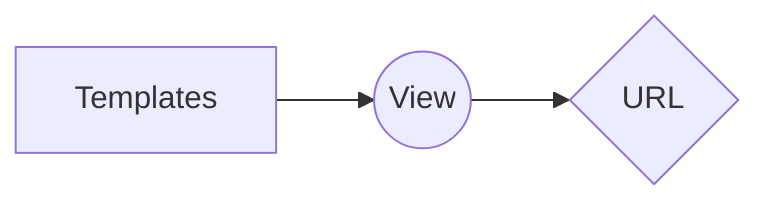
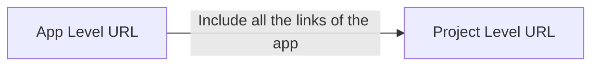

- [1. Initial Start](#1-initial-start)
- [2. Custom Users App](#2-custom-users-app)
  - [2.1. config/settings](#21-configsettings)
  - [2.2. users/models.py](#22-usersmodelspy)
  - [2.3. users/urls](#23-usersurls)
  - [2.4. users/views](#24-usersviews)
  - [2.5. users/forms.py](#25-usersformspy)
  - [2.6. users/admin.py](#26-usersadminpy)
  - [2.7. Troubleshooting DB](#27-troubleshooting-db)
- [3. Templates](#3-templates)
  - [3.1. config/settings.py](#31-configsettingspy)
  - [3.2. temlpates/base](#32-temlpatesbase)
  - [3.3. temlpates/home](#33-temlpateshome)
    - [Adding user auth](#adding-user-auth)
  - [3.4. templates/registration/login](#34-templatesregistrationlogin)
  - [3.5. templates/signup](#35-templatessignup)
  - [3.6. templates/registration/password_change_form](#36-templatesregistrationpassword_change_form)
  - [3.7. templates/registration/password_change_done](#37-templatesregistrationpassword_change_done)
  - [3.8. templates/registration/password_reset_form](#38-templatesregistrationpassword_reset_form)
  - [3.9. templates/registration/password_reset_complete](#39-templatesregistrationpassword_reset_complete)
  - [3.10. templates/registration/password_reset_confirm](#310-templatesregistrationpassword_reset_confirm)
  - [3.11. templates/registration/password_reset_done](#311-templatesregistrationpassword_reset_done)
    - [3.11.1. Email](#3111-email)
  - [3.12. templates/registration/password_reset_email](#312-templatesregistrationpassword_reset_email)
  - [3.13. templates/article_list](#313-templatesarticle_list)
  - [3.14. templates/article_detail](#314-templatesarticle_detail)
  - [3.15. templates/article_edit](#315-templatesarticle_edit)
  - [3.16. templates/article_delete](#316-templatesarticle_delete)
  - [3.17. templates/article_new](#317-templatesarticle_new)
  - [3.18. Updated templates/home](#318-updated-templateshome)
  - [3.19. Updated templates/base](#319-updated-templatesbase)
  - [3.20. config/urls.py](#320-configurlspy)
  - [3.21. config/settings.py](#321-configsettingspy)
- [4. Pages App](#4-pages-app)
  - [4.1. Pattern in adding new pages](#41-pattern-in-adding-new-pages)
  - [4.2. config/urls](#42-configurls)
  - [4.3. pages/urls](#43-pagesurls)
  - [4.4. pages/views](#44-pagesviews)
  - [4.5. Adding bootstarp to templates html](#45-adding-bootstarp-to-templates-html)
  - [4.6. adding and customizing pages (view template section)](#46-adding-and-customizing-pages-view-template-section)
  - [4.7. config/settings](#47-configsettings)
- [5. Articles App](#5-articles-app)
  - [5.1. articles/models](#51-articlesmodels)
  - [5.2. config/urls](#52-configurls)
  - [5.3. articles/urls.py](#53-articlesurlspy)
  - [5.4. articles/views.py](#54-articlesviewspy)
    - [Adding authorization](#adding-authorization)
  - [5.5. adding htmls (view template section)](#55-adding-htmls-view-template-section)
  - [5.6. articles/admin](#56-articlesadmin)
- [6. Static](#6-static)
- [7. Git](#7-git)
  - [7.1. Creating a new repository](#71-creating-a-new-repository)
  - [7.2. Push an existing folder](#72-push-an-existing-folder)
  - [7.3. Push an existing Git repository](#73-push-an-existing-git-repository)
  - [7.4. If you want to remove folder form git and keep it locally](#74-if-you-want-to-remove-folder-form-git-and-keep-it-locally)
  - [7.5. Global .gitignore for your machine](#75-global-gitignore-for-your-machine)
  - [7.6. Generate SSH key](#76-generate-ssh-key)
- [8. Deployment](#8-deployment)
  - [8.1. Django Deplyoment Checklist](#81-django-deplyoment-checklist)
  - [8.2. Heroku](#82-heroku)
    - [8.2.1. Procfile](#821-procfile)
  - [8.3. Heroku Deployment](#83-heroku-deployment)
- [9. Test Cases](#9-test-cases)
  - [9.1. pages/tests](#91-pagestests)

# 1. Initial Start

Create a folder, install django and run the shell

    $ cd ~/Desktop
    $ mkdir news
    $ cd news
    $ pipenv install django
    $ pipenv shell

it will create a pipenv environment start a project and don't forget the "." at the end of the code

    (news) $ django-admin startproject config .
    (news) $ python manage.py startapp users
    (news) $ python manage.py startapp pages
    (news) $ python manage.py startapp articles

Run server

    (news) $ python manage.py runserver

**Note** that we did not run migrate to configure our database. It’s important to wait until
after we’ve created our new custom user model before doing so given how tightly
connected the user model is to the rest of Django.

# 2. Custom Users App

Always use a **custom user model** for all new Django projects, using `AbstractUser` not `AbstractBaseUser`

Creating our custom user model requires four steps:

- update settings.py
- create a new CustomUser model
- update the admin
- create new forms for UserCreationForm and UserChangeForm

Tell django about the new app `pages` and `users` by adding it to the bottom of `INSTALLED_APPS` in the `config/settings.py`

## 2.1. config/settings

    INSTALLED_APPS = [

        # Local
        'users.apps.UsersConfig',
        'pages.apps.PagesConfig',
        'articles.apps.ArticlesConfig', 
    ]

    ...

    AUTH_USER_MODEL = 'users.CustomUser' # new

## 2.2. users/models.py

A model is the single, definitive source of information about your data. It contains the essential fields and behaviors
of the data you’re storing. Generally, each model maps to a **single database table.**

- Each model is a Python class that subclasses django.db.models.Model.
- Each attribute of the model represents a database field.
- With all of this, Django gives you an automatically-generated database-access API

We will “model” the characteristics of the data in our database.

    from django.db import models
    from django.contrib.auth.models import AbstractUser
    # Create your models here.

    class CustomUser(AbstractUser):
        age = models.PositiveIntegerField(null=True, blank=True)

- null is database-related. When a field has null=True it can store a database entry as NULL , meaning no value.
- blank is validation-related, if blank=True then a form will allow an empty value, whereas if blank=False then a value is required.

## 2.3. users/urls

**Note** signup page from the templates needs to be created first before adding the views and the urls, i added it here to group them together

    from django.urls import path

    from .views import SignUpView

    urlpatterns = [
        path('signup/', SignUpView.as_view(), name='signup'),
    ]

## 2.4. users/views

    from django.urls import reverse_lazy
    from django.views.generic import CreateView

    from .forms import CustomUserCreationForm

    class SignUpView(CreateView):
        form_class = CustomUserCreationForm
        success_url = reverse_lazy('login')
        template_name = 'signup.html'

Why use reverse_lazy here instead of reverse ? The reason is that for all generic class- based views the URLs are not loaded when the file is imported, so we have to use the lazy form of reverse to load them later when they’re available.

## 2.5. users/forms.py

create it first `touch users/forms.py`

    from django import forms
    from django.contrib.auth.forms import UserChangeForm, UserCreationForm

    from .models import CustomUser

    class CustomUserCreationForm(UserCreationForm):
        class Meta(UserCreationForm.Meta):
            model = CustomUser
            # default forms - fields = UserCreationForm.Meta.fields + ('age',)
            fields = ('username', 'email', 'age',) # new after fixing the templates

    class CustomUserChangeForm(UserChangeForm):
        class Meta:
            model = CustomUser
            # default forms - fields = UserChangeForm.Meta.fields
            fields = ('username', 'email', 'age',) 

The only other step we need is to update our admin.py file since Admin is tightly
coupled to the default User model. We will extend the existing UserAdmin class to
use our new CustomUser model.

## 2.6. users/admin.py

    from django.contrib import admin
    from django.contrib.auth.admin import UserAdmin

    # Register your models here.

    from .forms import CustomUserChangeForm, CustomUserCreationForm
    from .models import CustomUser

    class CustomUserAdmin(UserAdmin):
        add_form = CustomUserCreationForm
        form = CustomUserChangeForm
        model = CustomUser
        list_display = ['email', 'username', 'age', 'is_staff', ] # customize what to show
        fieldsets = UserAdmin.fieldsets + (
            (None, {'fields': ('age',)}),
        )
        add_fieldsets = UserAdmin.add_fieldsets + (
            (None, {'fields': ('age',)}),
        )

    admin.site.register(CustomUser, CustomUserAdmin)

make the migration

    (news) $ python manage.py makemigrations users
    (news) $ python manage.py migrate

## 2.7. Troubleshooting DB

    python manage.py makemigrations
    python manage.py migrate --run-syncdb

**Super user**

    (news) $ python manage.py createsuperuser

# 3. Templates

**Note** templates are ch 9 of the book and ch 10 of the git repo

Create a project-level directory called templates, and a home.html template file. it will also be used for user authentication

    (news) $ mkdir templates
    (news) $ touch templates/home.html
    (news) $ touch templates/base.html
    (news) $ mkdir templates/registration
    (news) $ touch templates/registration/login.html
    (news) $ touch templates/signup.html

Add the settings.py directory of the template

## 3.1. config/settings.py

    TEMPLATES = [
    	{
    		...
    		'DIRS': [os.path.join(BASE_DIR, 'templates')], # new
    		...
    	},
    ]
    ...
    LOGIN_REDIRECT_URL = 'home'
    LOGOUT_REDIRECT_URL = 'home'

## 3.2. temlpates/base

    <!-- temlpates/base.html -->
    <html>
    <head>
        <title>Newspaper App</title>
    </head>
    <body>
        <header>
            <h1><a href="">Django news</a></h1>
        </header>
        

            
            
        

    </body>
    </html>

##  3.3. temlpates/home

In our templates file home.html we can use the Django Templating Language’s for a loop to list all the objects in
object_list Why **object_list** ? This is the name of the variable that ListView returns to us.

    <!-- templates/home.html -->
    
    Home

    
        
            

                <h2><a href="">{{ post.title }}</a></h2>
                
{{ post.body }}

            

        
    

In order to fix the naming of **object_list** we need to rename the return of the views of the `articles/views.py`
called `context_object_name = 'what ever name you want'` here we called `all_articles_list`

    <!-- templates/home.html -->
    

    
        
            

                <h2><a href="">{{ post.title }}</a></h2>
                
{{ post.body }}

            

        
    

### Adding user auth

    <!-- templates/home.html -->
    

    
        
            Hi {{ user.username }}!
            
<a href="">Log Out</a>

            
                

                    <h2><a href="">{{ post.title }}</a></h2>
                    
{{ post.body }}

                

            
        
            
You are not logged in

            <a href="">Log In</a> |
            <a href="">Sign Up</a>
        

    

## 3.4. templates/registration/login

    <!-- templates/registration/login.html -->

    
    Log In
    

    <h2>Log In</h2>
    <form method="post">
        
        {{ form.as_p }}
    <button class="btn btn-success ml-2" type="submit">Log In</button>
    </form>
    

- Adding a `` which Django provides to protect our form from cross-
site scripting attacks. You should use it for all your Django forms.
- Then to output our form data we use `{{ form.as_p }}` which renders it within
paragraph 
 tags.
- the btn class is added after the bootstrap cripy installation

## 3.5. templates/signup

    <!-- templates/signup.html -->

    
     # added after installing crispy

    Sign Up
    

    <h2>Sign Up</h2>
    <form method="post">
        
         old {{ form.as_p }} 
        {{ form|crispy }}
        <button class="btn btn-success" type="submit">Sign Up</button>    
        </form>
    

~~{{ form.as_p }}~~ will be replaced by `` after installing cripy (check pages app)

**Note I** Templates is for only html, dosen't have templates/urls.py nor views.py, it will be on the users/views and users/urls

**Note II** for a better form please install crispy form, check next chapter

## 3.6. templates/registration/password_change_form
Let’s customize these two password change pages so that they match the look and
feel of our Newspaper site. Because Django already has created the views and URLs
for us, we only need to add new templates.

    (news) $ touch templates/registration/password_change_form.html
    (news) $ touch templates/registration/password_change_done.html
    (news) $ touch templates/registration/password_reset_form.html
    (news) $ touch templates/registration/password_reset_done.html
    (news) $ touch templates/registration/password_reset_confirm.html
    (news) $ touch templates/registration/password_reset_complete.html

then

    

    Password Change

    
    <h1>Password change</h1>
    
Please enter your old password, for security's sake, and then enter your new password twice so we can verify you typed it in correctly.

    <form method="POST">
        
        {{ form.as_p }}
        <input class="btn btn-success" type="submit" value="Change my password">
    </form>
    

## 3.7. templates/registration/password_change_done

    

    Password Change Successful

    
        <h1>Password change successful</h1>
        
Your password was changed.

    

## 3.8. templates/registration/password_reset_form
    

    Forgot Your Password?

    
    <h1>Forgot your password?</h1>
    
Enter your email address below, and we'll email instructions for setting a new one.

    <form method="POST">
    
    {{ form.as_p }}
    <input class="btn btn-success" type="submit" value="Send me instructions!">
    </form>
    
## 3.9. templates/registration/password_reset_complete

    

    Password reset complete

    
    <h1>Password reset complete</h1>
    
Your new password has been set. You can log in now on the <a href=\
    "">log in page</a>.

    
## 3.10. templates/registration/password_reset_confirm
    

    Enter new password

    
    <h1>Set a new password!</h1>
    <form method="POST">
    
    {{ form.as_p }}
    <input class="btn btn-success" type="submit" value="Change my password">
    </form>
    
## 3.11. templates/registration/password_reset_done
    

    Email Sent

    
    <h1>Check your inbox.</h1>
    
We've emailed you instructions for setting your password. You should receive the email shortly!

    

### 3.11.1. Email

using [sendgrid](https://sendgrid.com/), click on “Integrate using our Web API or SMTP relay” then “SMTP Relay”

    (news) $ touch templates/registration/password_reset_email.html
    (news) $ touch templates/registration/password_reset_subject.txt

and in the subject.txt add `Please reset your password`
## 3.12. templates/registration/password_reset_email

    
     {{ user.get_username }},

    

    
    {{ protocol }}://{{ domain }}
    
    

## 3.13. templates/article_list

**after installing the articles app**

    

    Articles

    
    
    {% comment }  

        

        

            {{ article.title }} &middot;
            by {{ article.author }} | {{ article.date }}
        

        

            {{ article.body }}
        

        

            <a href="">Edit</a> |
            <a href="">Delete</a>
        

        

         
    
    

instead of using `object_list` we add `context_object_name` in the views and give it cutom name this case will be instead of `object_list` it will be `all_articles_list`

    (news) $ touch templates/article_detail.html
    (news) $ touch templates/article_edit.html
    (news) $ touch templates/article_delete.html
    (news) $ touch templates/article_list.html
    (news) $ touch templates/article_new.html

## 3.14. templates/article_detail

    

    
    

    <h2>{{ object.title }}</h2>
        
by {{ object.author }} | {{ object.date }}

        
{{ object.body }}

    

    
<a href="">Edit</a> | <a href="">Delete</a>

    
Back to <a href="">All Articles</a>.

    
## 3.15. templates/article_edit

    

    
        <h1>Edit</h1>
        <form action="" method="post">
        {{ form.as_p }}
        <button class="btn btn-info ml-2" type="submit">Update</button>
    </form>
    

## 3.16. templates/article_delete
    

    
        <h1>Delete</h1>
        <form action="" method="post">
        
Are you sure you want to delete "{{ article.title }}"?

        <button class="btn btn-danger ml-2" type="submit">Confirm</button>
        </form>
    

## 3.17. templates/article_new
    

    
        <h1>New article</h1>
        <form action="" method="post">
        {{ form.as_p }}
        <button class="btn btn-success ml-2" type="submit">Save</button>
        </form>
    

## 3.18. Updated templates/home

    

    Home

    
    

    <h1 class="display-4">Newspaper app</h1>
    
A Newspaper website built with Django.

    

        <a class="btn btn-primary btn-lg" href="" role="button">View All Articles</a>
    

    

    

## 3.19. Updated templates/base

    <!doctype html>
    <html lang="en">
    <head>
        <!-- Required meta tags -->
        <meta charset="utf-8">
        <meta name="viewport" content="width=device-width, initial-scale=1, shrink-to-fit=no">

        <!-- Bootstrap CSS -->
        <link rel="stylesheet" href="https://stackpath.bootstrapcdn.com/bootstrap/4.1.3/css/bootstrap.min.css" integrity="sha384-MCw98/SFnGE8fJT3GXwEOngsV7Zt27NXFoaoApmYm81iuXoPkFOJwJ8ERdknLPMO" crossorigin="anonymous">

        <title>Newspaper App</title>
    </head>
    <body>
        <nav class="navbar navbar-expand-md navbar-dark bg-dark mb-4">
        <a class="navbar-brand" href="">Newspaper</a>
        
            <ul class="navbar-nav mr-auto">
            <li class="nav-item"><a href="">+ New</a></li>
            </ul>
        
        <button class="navbar-toggler" type="button" data-toggle="collapse" data-target="#navbarCollapse" aria-controls="navbarCollapse" aria-expanded="false" aria-label="Toggle navigation">
            
        </button>
        

            
            <ul class="navbar-nav ml-auto">
                <li class="nav-item">
                <a class="nav-link dropdown-toggle" href="#" id="userMenu" data-toggle="dropdown" aria-haspopup="true" aria-expanded="false">
                    {{ user.username }}
                </a>
                

                    <a class="dropdown-item" href="">Change password</a>
                    

                    <a class="dropdown-item" href="">
                    Log Out</a>
                

                </li>
            </ul>
            
            <form class="form-inline ml-auto">
                <a href="" class="btn btn-outline-secondary">
                Log In</a>
                <a href="" class="btn btn-primary ml-2">
                Sign up</a>
            </form>
            
        

        </nav>
        

        
        
        

        <!-- Optional JavaScript -->
        <!-- jQuery first, then Popper.js, then Bootstrap JS -->
        
        
        
    </body>
    </html>

## 3.20. config/urls.py

    from django.contrib import admin
    from django.urls import path, include

    urlpatterns = [
        path('admin/', admin.site.urls),
        path('users/', include('users.urls')),
        path('users/', include('django.contrib.auth.urls')),
        path('', include('pages.urls')), 
    ]

also the default template to be replaced when `pages app` created in urlpatterns

~~from django.views.generic.base import TemplateView~~

~~path('', TemplateView.as_view(template_name='home.html'), name='home'),~~

## 3.21. config/settings.py

    # for the pass reset (debug mode)
    EMAIL_BACKEND = 'django.core.mail.backends.console.EmailBackend'

    # for the pass reset (sendgrid production mode)
    EMAIL_BACKEND = 'django.core.mail.backends.smtp.EmailBackend' 
    DEFAULT_FROM_EMAIL = 'your_custom_email_account'
    EMAIL_HOST = 'smtp.sendgrid.net'
    EMAIL_HOST_USER = 'apikey'
    EMAIL_HOST_PASSWORD = 'sendgrid_password'
    EMAIL_PORT = 587
    EMAIL_USE_TLS = True

# 4. Pages App
 
**Note I** templates are ch 10 of the book and ch 11 of the git repo Bootstrap
 
**Note II** all the new apps created plus the crispy for i already added it in first section Initial start

## 4.1. Pattern in adding new pages

As for the URL

Then we add the path of the `home` to `config/urls.py` that includes the URLs of pages/urls.py that have all the links inside it for the pages app

## 4.2. config/urls

    from django.contrib import admin
    from django.urls import path, include
    from django.views.generic.base import TemplateView

    urlpatterns = [
        path('admin/', admin.site.urls),
        path('users/', include('users.urls')),
        path('users/', include('django.contrib.auth.urls')),
        path('', include('pages.urls')), 
    ]

## 4.3. pages/urls

    (news) $ touch pages/urls.py

    # pages/urls.py
    from django.urls import path
    from .views import HomePageView
    urlpatterns = [
        path('', HomePageView.as_view(), name='home'),
    ]

## 4.4. pages/views

    # pages/views.py

    from django.views.generic import TemplateView
    class HomePageView(TemplateView):
        template_name = 'home.html'

## 4.5. Adding bootstarp to templates html

check the code for templates (too big to add here)

we can customize login button

customizing the sign up pages adding crispy 

    (news) $ pipenv install django-crispy-forms

## 4.6. adding and customizing pages (view template section)

## 4.7. config/settings

in `INSTALLED_APPS` add

    # 3rd Party
    'crispy_forms', # new

and at the end of the file add

    CRISPY_TEMPLATE_PACK = 'bootstrap4'

# 5. Articles App

Next up we define our database model which contains four fields: title , body , date ,
and author

For the author field we want to reference our custom user
model `users.CustomUser` which we set in the `settings.py` file as `AUTH_USER_MODEL` .

We can do this via get_user_model. And we also implement the best practices of
defining a `get_absolute_url` from the beginning and a `__str__` method for viewing
the model in our admin interface.

## 5.1. articles/models

    from django.conf import settings
    from django.contrib.auth import get_user_model
    from django.db import models
    from django.urls import reverse

    class Article(models.Model):
        title = models.CharField(max_length=255)
        body = models.TextField()
        date = models.DateTimeField(auto_now_add=True)
        author = models.ForeignKey(
            get_user_model(),
            on_delete=models.CASCADE,
        )

        def __str__(self):
            return self.title

        def get_absolute_url(self):
            return reverse('article_detail', args=[str(self.id)])

we should use `get_absolute_url` It sets a canonical URL for an object so even if
the structure of your URLs changes in the future, the reference to the specific object
is the same. In short, you should add a `get_absolute_url()` and `__str__()` method to
**each model** you write.

For the author field we’re using a ForeignKey which allows for a many-to-one relationship. This means that a given user
can be the author of many different blog posts but not the other way around. The reference is to the built-in User model
that Django provides for authentication. For all many-to-one relationships such as a ForeignKey we must also specify an
on_delete option.

Since we have a brand new app and model, it’s time to make a new migration file and
then apply it to the database.

    (news) $ python manage.py makemigrations articles
    (news) $ python manage.py migrate

## 5.2. config/urls

add the articles in installed apps

    path('articles/', include('articles.urls')), # new

## 5.3. articles/urls.py

    (news) $ touch articles/urls.py

Then populate it with our routes. Let’s start with the page to list all articles at
articles/ which will use the view ArticleListView .

    # articles/urls.py
    from django.urls import path
    from .views import ArticleListView
    urlpatterns = [
        ath('', ArticleListView.as_view(), name='article_list'),
    ]

we need to add the rest of the pages edit, add, delete

    from django.urls import path
    from .views import ArticleListView

    from .views import (
        ArticleListView,
        ArticleUpdateView,
        ArticleDetailView,
        ArticleDeleteView,
        ArticleCreateView  # new
    )

    urlpatterns = [
        path('<int:pk>/edit/',
            ArticleUpdateView.as_view(), name='article_edit'),
        path('<int:pk>/',
            ArticleDetailView.as_view(), name='article_detail'),
        path('<int:pk>/delete/',
            ArticleDeleteView.as_view(), name='article_delete'),
        path('new/', ArticleCreateView.as_view(), name='article_new'),
        path('', ArticleListView.as_view(), name='article_list'),
    ]

Next is the primary key for our post-entry which will be represented as an integer `<int:pk>`

Django automatically adds an auto-incrementing primary key to our database models.

So while we only declared the fields title , author , and body on our Post model, under-the-hood Django also added
another field called id , which is our primary key. We can **access it as either id or pk**.

To be able to navigate to the post, in `templates/home.html` in anchor add the href ``

Now write up our views which will use Django’s generic class-based views
DetailView , UpdateView and DeleteView . We specify which fields can be updated– title
and body –and where to redirect the user after deleting an article: article_list .

## 5.4. articles/views.py
Now create our view using the built-in generic ListView from Django.

    # articles/views.py
    from django.views.generic import ListView
    from .models import Article
    class ArticleListView(ListView):
        model = Article
        template_name = 'article_list.html'
    	# context_object_name = 'all_articles_list'

Internally ListView returns an object called object_list that we want to display in our template. to replace that default naming we use `context_object_name` and give it a value we can use and understand 

### Adding authorization
At present the author on a new article can be set to any user. Instead it should
be automatically set to the current user. The default `CreateView` provides a lot of
functionality for us but in order to set the current user to author we need to customize
it. We will remove author from the fields and instead set it automatically via the
`form_valid` method. in **articles/views.py**

`Generic class-based views`

To restrict view access to only logged in users, Django has a `LoginRequiredMixin`  that
we can use. It’s powerful and extremely concise.
adding the redirect login in case the user is not authenticated

    from django.contrib.auth.mixins import LoginRequiredMixin, UserPassesTestMixin
    from django.views.generic import ListView, DetailView
    from django.views.generic.edit import UpdateView, DeleteView, CreateView
    from django.urls import reverse_lazy

    from .models import Article

    class ArticleListView(LoginRequiredMixin, ListView):
        model = Article
        template_name = 'article_list.html'
        login_url = 'login'

    class ArticleDetailView(LoginRequiredMixin, DetailView):
        model = Article
        template_name = 'article_detail.html'
        login_url = 'login'

    class ArticleUpdateView(LoginRequiredMixin, UserPassesTestMixin, UpdateView):
        model = Article
        fields = ('title', 'body',)
        template_name = 'article_edit.html'
        login_url = 'login'

        def test_func(self):
            obj = self.get_object()
            return obj.author == self.request.user

        # def dispatch(self, request, *args, **kwargs):
        #     obj = self.get_object()
        #     if obj.author != self.request.user:
        #         raise PermissionDenied
        #     return super().dispatch(request, *args, **kwargs)

    class ArticleDeleteView(LoginRequiredMixin, UserPassesTestMixin, DeleteView):
        model = Article
        template_name = 'article_delete.html'
        success_url = reverse_lazy('article_list')
        login_url = 'login'

        def test_func(self):
            obj = self.get_object()
            return obj.author == self.request.user

        # def dispatch(self, request, *args, **kwargs):
        #     obj = self.get_object()
        #     if obj.author != self.request.user:
        #         raise PermissionDenied
        #     return super().dispatch(request, *args, **kwargs)

    
    # class ArticleCreateView(CreateView):
    class ArticleCreateView(LoginRequiredMixin, CreateView):
        model = Article
        template_name = 'article_new.html'
        # fields = ('title', 'body', 'author',)
        fields = ('title', 'body')
        login_url = 'login'

        def form_valid(self, form):
            form.instance.author = self.request.user
            return super().form_valid(form)
        
The test_func method is used by UserPassesTestMixin for our logic. We need to
override it. In this case we set the variable obj to the current object returned by the
view using get_object() . Then we say, if the author on the current object matches the
current user on the webpage (whoever is logged in and trying to make the change),
then allow it. If false, an error will automatically be thrown.

## 5.5. adding htmls (view template section)

## 5.6. articles/admin

register the app in admin 

    from django.contrib import admin
    from .models import Article
    admin.site.register(Article)

# 6. Static

    (news) $ mkdir static

We can update settings.py with a one-line change for STATICFILES_DIRS . Add it at the bottom of the file below the entry
for STATIC_URL .

    # config/settings.py
    STATICFILES_DIRS = [os.path.join(BASE_DIR, 'static')]

Now create a css folder within static and add a new base.css file in it. Command Line

    (news) $ mkdir static/css
    (news) $ touch static/css/base.css

For example

    /* static/css/base.css */
    header h1 a {
    color: red;
    }

add `` to the top of base.html

Because our other templates inherit from `base.html` we only have to add this once. Include a new line at the bottom of
the <head></head> code that explicitly references our new base.css file.

    <!-- templates/base.html -->
    
    <html>
    <head>
        <title>Django articles</title>
        <link href="" rel="stylesheet">
    </head>

# 7. Git

## 7.1. Creating a new repository

    git clone https://github.com/danielawde9/django-blog-app.git
    cd django-blog-app
    git add -A
    git commit -m "Initial Commit"
    git push -u origin master

## 7.2. Push an existing folder

    git init
    git add -A
    git commit -m 'initial commit'
    git remote add origin git@github.com:danielawde9django-blog-app.git
    git push -u origin master

## 7.3. Push an existing Git repository

    cd existing_repo
    git remote rename origin old-origin
    git remote add origin git@github.com:danielawde9/django-blog-app.git
    git push -u origin --all
    git push -u origin --tags

## 7.4. If you want to remove folder form git and keep it locally

    # Remove the file from the repository
    git rm --cached - r .idea/

    # now update your gitignore file to ignore this folder
    echo '.idea' >> .gitignore

    # add the .gitignore file
    git add .gitignore

    git commit -m "Removed .idea files"
    git push origin origin

## 7.5. Global .gitignore for your machine

    touch ~/.gitignore

Nano into it and add

    .idea

then in terminal

    git config --global core.excludesfile '~/.gitignore'

Now all future git repo will ignore .idea folder

## 7.6. Generate SSH key

    ssh-keygen -t ed25519 -C “Comment”

Then add .pub which is the public key to gitlab usually in `.ssh/key.pub`

# 8. Deployment

## 8.1. Django Deplyoment Checklist

    Run manage.py check --deploy

The secret key must be a large random value and it must be kept secret.

Make sure that the key used in production isn’t used anywhere else and avoid committing it to source control. This reduces the number of vectors from which an attacker may acquire the key.

Instead of hardcoding the secret key in your settings module, consider loading it from an environment variable:

To be tested
import os
SECRET_KEY = os.environ['SECRET_KEY']

You must never enable debug in production.

You’re certainly developing your project with `DEBUG = True`, since

    ALLOWED_HOSTS = ['.herokuapp.com', 'localhost', '127.0.0.1']

## 8.2. Heroku

- update Pipfile.lock
- new Procfile
- install gunicorn
- update settings.py

**Check `Pipfile` python required version**

    [requires]
    python_version = "3.7"

Run `pipenv lock` to generate the appropriate `Pipfile.lock` incase its not present.

### 8.2.1. Procfile

Then create a Procfile which tells Heroku how to run the remote server where our code will live.

    touch Procfile

For now, we’re telling Heroku to use gunicorn as our production server and look in our blog_project.wsgi file for further instructions.

Inside the Procfile

    web: gunicorn blog_project.wsgi --log-file -

Next install gunicorn which we’ll use in production while still using Django’s internal server for local development use.

    (news) $ pipenv install gunicorn

## 8.3. Heroku Deployment

Make sure to login

    (news) $ heroku login
    (news) $ heroku create

Now we need to add a **hook** for Heroku within a git. This means that git will store both our settings for pushing code
to Bitbucket and to Heroku.

My app name is `calm-badlands-09889` so the command will be

    (news) $ heroku git:remote -a calm-badlands-09889

~~Tell Heroku to ignore static files which we’ll cover in-depth when deploying our Blog app later in the book.~~

`~~(news) $ heroku config:set DISABLE_COLLECTSTATIC=1~~

There’s one more step we need to take now that we have static files, which in our
case is CSS. Django does not support serving static files in production however the
WhiteNoise project does. So let’s install it.

    (news) $ pipenv install whitenoise

in our `settings.py` file add `ALLOWED_HOSTS`

    # news_project/settings.py
    ALLOWED_HOSTS = ['*']

Add whitenoise to the INSTALLED_APPS above the built-
in staticfiles app and also to MIDDLEWARE on the third line. Order matters for both
INSTALLED_APPS and MIDDLEWARE .

    INSTALLED_APPS = [
        ....
        'whitenoise.runserver_nostatic', # new!
        'django.contrib.staticfiles',
    ]

    MIDDLEWARE = [
        'django.middleware.security.SecurityMiddleware',
        'django.contrib.sessions.middleware.SessionMiddleware',
        'whitenoise.middleware.WhiteNoiseMiddleware', # new!
        'django.middleware.common.CommonMiddleware',
        'django.middleware.csrf.CsrfViewMiddleware',
        'django.contrib.auth.middleware.AuthenticationMiddleware',
        'django.contrib.messages.middleware.MessageMiddleware',
        'django.middleware.clickjacking.XFrameOptionsMiddleware',
    ]

at the bottom add

    STATIC_ROOT = os.path.join(BASE_DIR, 'staticfiles') # new!
    STATIC_URL = '/static/'
    STATICFILES_DIRS = [os.path.join(BASE_DIR, 'static')]
    STATICFILES_STORAGE = 'whitenoise.storage.CompressedManifestStaticFilesStorage'

Push the code to Heroku and add free scaling, so it’s actually running online, otherwise the code is just sitting there.

    (news) $ git push heroku master
    (news) $ heroku ps:scale web=1

also git commit and push

# 9. Test Cases

## 9.1. pages/tests

    from django.contrib.auth import get_user_model
    from django.test import SimpleTestCase, TestCase
    from django.urls import reverse

    class HomePageTests(SimpleTestCase):

        def test_home_page_status_code(self):
            response = self.client.get('/')
            self.assertEqual(response.status_code, 200)

        def test_view_url_by_name(self):
            response = self.client.get(reverse('home'))
            self.assertEqual(response.status_code, 200)

        def test_view_uses_correct_template(self):
            response = self.client.get(reverse('home'))
            self.assertEqual(response.status_code, 200)
            self.assertTemplateUsed(response, 'home.html')

    class SignupPageTests(TestCase):

        username = 'newuser'
        email = 'newuser@email.com'

        def test_signup_page_status_code(self):
            response = self.client.get('/users/signup/')
            self.assertEqual(response.status_code, 200)

        def test_view_url_by_name(self):
            response = self.client.get(reverse('signup'))
            self.assertEqual(response.status_code, 200)

        def test_view_uses_correct_template(self):
            response = self.client.get(reverse('signup'))
            self.assertEqual(response.status_code, 200)
            self.assertTemplateUsed(response, 'signup.html')

        def test_signup_form(self):
            new_user = get_user_model().objects.create_user(
                self.username, self.email)
            self.assertEqual(get_user_model().objects.all().count(), 1)
            self.assertEqual(get_user_model().objects.all()
                            [0].username, self.username)
            self.assertEqual(get_user_model().objects.all()
                            [0].email, self.email)